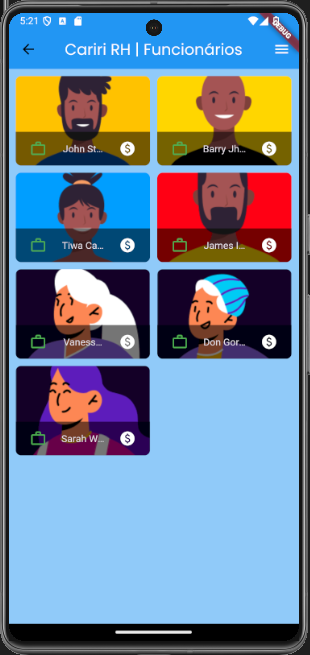

# Projeto-Integrado-IV

## Cariri RH - Sistema Web

Este repositório consiste do desenvolvimento de uma aplicação web com foco na gestão de recursos humanos. Tal projeto é parte da disciplina de “Projeto Integrado IV” da Universidade Federal do Cariri (UFCA).

### Autores:

- Mat: 2022010446 - Abner Colman Mendonça - (@abnercoolman);
- Mat: 2022012191 - Pedro Hilbert Silva Guerra - (@PedroHilbert);
- Mat: 2022011873 - Emanohelly Pereira de Sousa - (@emanohelly).

### 1. Objetivo

Desenvolver uma plataforma, com foco na gestão de recursos humanos.

### 2. Estruturação do Desenvolvimento da Plataforma

- Páginas:
  - Login;
  - Cadastro;
  - Home;
  - Detalhes do Funcionário;
  - Folha de Pagamento;

### Prints do App:

| Página                                          | Página                                          | Página                                          |
| ----------------------------------------------- | ----------------------------------------------- | ----------------------------------------------- |
| **_Splash_**                                    | **_Login_**                                     | **_Cadastro_**                                  |
|  |  |  |
| **_Home_**                                      |                                                 |                                                 |
|  |                                                 |                                                 |
